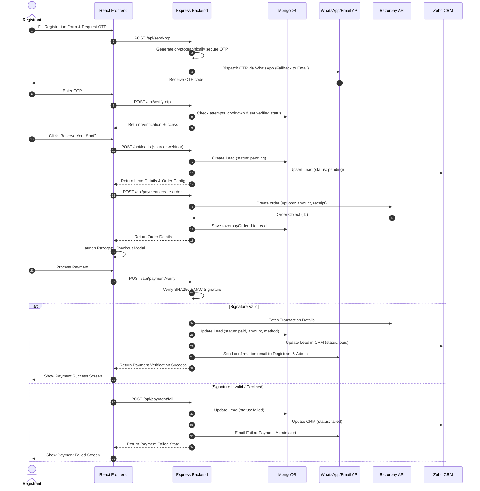
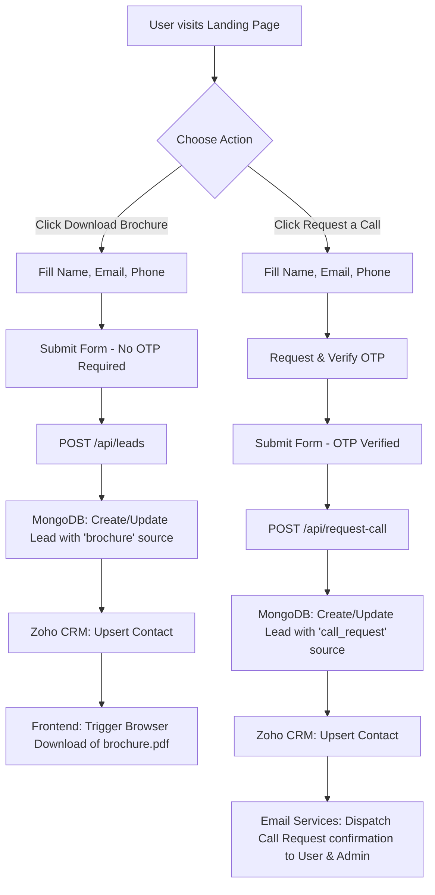

# Project Overview: Webinar Registration & Lead Management Platform

This document provides a comprehensive overview of the webinar registration, payment processing, and lead management system. Designed using the MERN (MongoDB, Express, React, Node.js) stack, this platform automates user onboarding, processes secure payments, triggers context-aware reminder notifications, and integrates with CRM systems to streamline sales and marketing operations.

---

## 1. Project Purpose

The primary purpose of the platform is to serve as a high-conversion, frictionless gateway for acquiring and nurturing educational/professional leads. It bridges the gap between marketing initiatives (webinars, brochure downloads, call requests) and downstream CRM and operations tools, ensuring that:
1. **User engagement is smooth** through targeted modals, quick OTP verification, and instant downloads.
2. **Operations are automated** through scheduled reminders, instant payment reconciliation, and real-time CRM updates.
3. **Analytics & Administration are informed** via automated alerts regarding pending or failed transaction states, enabling rapid sales follow-ups.

---

## 2. Target Users

The platform is built to cater to three distinct user categories:

| Target User Group | Description | Key Interactivity |
| :--- | :--- | :--- |
| **Prospective Registrants** | Students, software developers, and IT professionals looking to upscale their skills. | Registering for webinars, downloading course brochures, requesting callback consultations, and initiating secure payments. |
| **System Administrators & Sales Teams** | Internal operations and marketing executives responsible for coordinating the event and closing leads. | Reviewing leads, receiving instant email alerts for registration states (paid, pending, failed), and utilizing synchronized CRM databases. |
| **Technical Managers / Developers** | Developers maintaining system integrity, checking scheduler logs, or managing API keys. | Monitoring API rate limits, scheduling patterns, Zoho CRM tokens, and payment webhooks. |

---

## 3. Business Problems Solved

Traditional webinar and training onboarding systems suffer from drop-offs, manual data tracking, and communication delays. This platform resolves these issues through structural optimizations:

* **Frictionless Lead Capture**: Allows users to download brochures instantly by capturing name, email, and phone without forcing OTP verification, keeping the download process low-barrier. Conversely, high-intent actions (webinar registration and call requests) enforce OTP verification to guarantee lead quality.
* **Lead Leakage Prevention**: Eliminates manual imports by utilizing an automated Zoho CRM API gateway. Contacts are synchronized on every form submission and payment transition.
* **High Webinar Attendance Rates**: Replaces manual reminder campaigns with a timezone-aware background cron scheduler, sending automated email templates at strategic intervals (7 days, 3 days, 1 day, and 30 minutes prior to the event).
* **Payment Abandonment Recovery**: Detects dropped checkout sessions. If a user registers for the webinar but leaves before completing the Razorpay payment, a cron job identifies the pending state after 15 minutes and immediately alerts administrators to initiate manual follow-up.
* **Spam & Abuse Defense**: Utilizes security layers including global and authentication-specific rate limits, NoSQL injection protection, and cryptographically secure OTP generation (with a strict cooldown and verification attempt limit of 5).

---

## 4. Major Functionalities

The system implements the following core functionalities:

```
┌────────────────────────────────────────────────────────────────────────┐
│                        CORE SYSTEM CAPABILITIES                        │
├───────────────────┬───────────────────┬────────────────────────────────┤
│  Lead Acquisition │ OTP Verification  │ Payment Gateway & Reminders    │
├───────────────────┼───────────────────┼────────────────────────────────┤
│ 🔹 Webinar Reg    │ 🔹 Secure 6-Digit │ 🔹 Razorpay API Integration     │
│ 🔹 PDF Download   │ 🔹 WhatsApp Primary│ 🔹 Multi-tier Scheduler (Cron) │
│ 🔹 Call Requests  │ 🔹 Email Fallback │ 🔹 Zoho CRM Sync Gateway       │
└───────────────────┴───────────────────┴────────────────────────────────┘
```

### A. Dynamic Lead Modalities
* **Webinar Registration**: Collects academic/career profiles (working profile, years of experience) along with verified contact details, leading to the payment gateway.
* **Brochure Download**: Enables instant access to the course catalog (`brochure.pdf`) upon entering contact details, capturing the user's initial interest as a lead.
* **Callback Consultation**: Collects user details and scheduled request parameters, triggering administrative notifications.

### B. Hybrid OTP Verification Engine
* Generates a cryptographically secure 6-digit OTP code using Node's `crypto` module.
* Dispatches verification codes via **WhatsApp** (Meta Cloud API) as the primary channel.
* Dynamically falls back to **SMTP Email** if the WhatsApp gateway encounters an error.
* Enforces a **30-second resend cooldown** and a **5-attempt verification cap** per contact to prevent brute-force attacks.

### C. Razorpay Payment Pipeline
* Initiates secure orders with custom receipt numbers linked to the MongoDB Lead ID.
* Features a robust backend verification endpoint using SHA256 HMAC signatures.
* Dynamically pulls metadata (payment method, transaction ID, and amount) post-payment to update MongoDB states from `"pending"` to `"paid"`.
* Handles modal exit/failure events, changing status to `"failed"` and updating Zoho CRM to alert sales representatives.

### D. Multi-Tier Background Scheduler
* Runs timezone-localized (`Asia/Kolkata`) cron tasks using `node-cron`:
  1. **Daily Email Job (9:00 AM IST)**: Sends webinar confirmation and count-down reminders at 7 days, 3 days, and 1 day remaining.
  2. **Start Reminder Job (Every 2 minutes)**: Scans for paid webinars starting in the next 30 minutes to deliver access links.
  3. **Payment Abandonment Alert (Every 2 minutes)**: Scans for pending webinar leads older than 15 minutes and notifies the admin.

### E. Robust Zoho CRM Sync Gateway
* Connects to Zoho CRM's API endpoints using a secure OAuth 2.0 flow (with refresh token exchange).
* Performs an **upsert** operation matching on email to avoid duplicate contacts, preserving historical context while adding new lead sources.

---

## 5. High-Level System Behavior

The sequence diagrams below detail how the frontend and backend interact during different user paths.

### Webinar Registration & Payment Lifecycle


### Brochure Download & Call Request Flow


---

## 6. Technical Stack Summary

* **Frontend**: React (Single Page Application architecture), Tailwind CSS (styling design tokens, gradients, animations), Lucid React (interface iconography).
* **Backend**: Express.js server, Node.js environment.
* **Database**: MongoDB (cloud-hosted database), Mongoose (ODM with validation and strict schema parsing).
* **External Services**:
  * **Razorpay**: Gateway integration for processing cards, UPI, net banking, and wallet transactions.
  * **Meta Graph API**: Direct cloud engine integration for WhatsApp message delivery.
  * **Nodemailer / SMTP Service**: Multi-channel transaction mail fallback engine.
  * **Zoho CRM (v2 REST API)**: Enterprise pipeline customer relation management synchronization.
  * **WhatsApp Support Link**: Global float component integration.
* **Infrastructure**: Hostinger deployment environment, structured around secure proxy rules (`trust proxy`), HTTP security headers (`helmet`), and query sanitization (`express-mongo-sanitize`).
